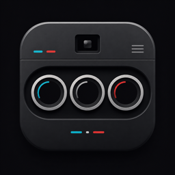
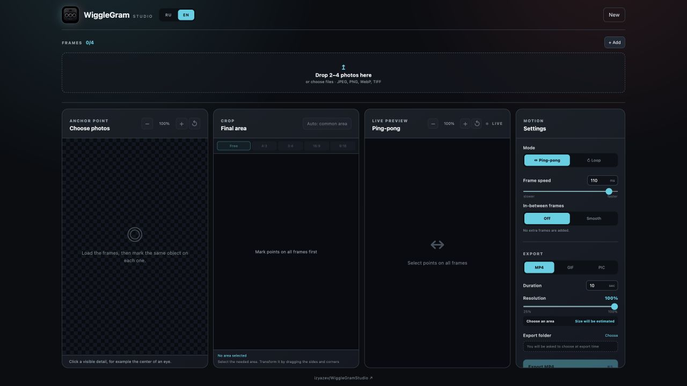
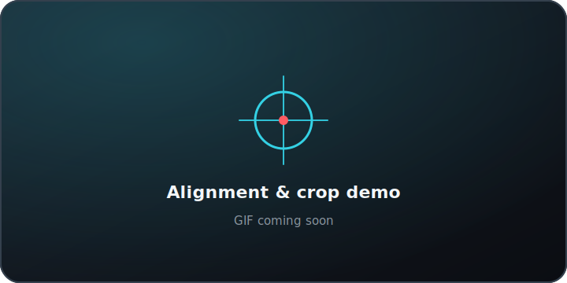
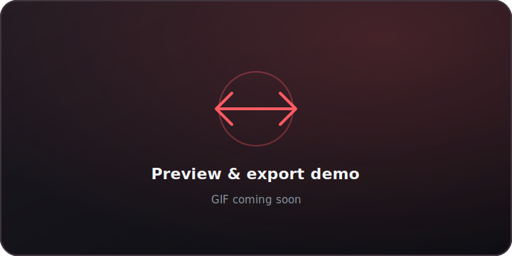

<div align="center">
  
  <h1>WiggleGram Studio</h1>
  <p><strong>Turn 2–4 frames from Nishika N8000, Nimslo 3D, Reto3D, or ImageTech 3Dfx into smooth, shareable wigglegrams.</strong></p>
  <p>A free desktop photo editor for aligning, cropping, previewing, and exporting MP4, GIF, or print-ready image sequences — entirely on your computer.</p>

  <p>
    <a href="https://github.com/izyazev/WiggleGramStudio/releases/latest"></a>
    
    
    <a href="LICENSE"></a>
  </p>

  <p><a href="https://github.com/izyazev/WiggleGramStudio/releases/latest"><strong>Download the latest release →</strong></a></p>
</div>

<br>



> **Private by design.** WiggleGram Studio processes everything locally. Your source photos are never modified and never leave your computer.

## From frames to wigglegram

| 1. Import | 2. Align | 3. Crop & preview | 4. Export |
|:--|:--|:--|:--|
| Drop in 2–4 photos from a Nishika N8000 or a similar multi-lens camera. | Mark the same visible point on every frame for precise X/Y alignment. | Choose the shared visible area, set an aspect ratio, and tune the motion. | Save as MP4, GIF, PNG, JPG, TIFF, or an aligned image sequence. |

## Made for the full wigglegram workflow

| | |
|:--|:--|
| **Fast frame alignment**<br>Place one anchor point per image. Frames are shifted without stretching or perspective distortion. | **Flexible cropping**<br>Use the common visible area, crop freely, or choose 4:3, 3:4, 16:9, and 9:16 presets. |
| **Live motion preview**<br>Switch between ping-pong and loop playback, then adjust frame timing until the motion feels right. | **Smooth interpolation**<br>Optionally generate in-between frames with FFmpeg optical flow for softer movement. |
| **Multiple export formats**<br>Create H.264 MP4, GIF, or aligned PNG, JPG, and TIFF sequences for print and lenticular workflows. | **No external dependencies**<br>Release builds include FFmpeg. Users do not need Homebrew or a separate FFmpeg installation. |
| **English and Russian UI**<br>The interface follows the system language and can be switched at any time. | **Built-in update checks**<br>The app checks GitHub Releases and shows a link when a newer version is available. |

## See it in motion

<!--
GIF SLOT 1
Replace the placeholder below with:

-->

<!--
GIF SLOT 2
Replace the placeholder below with:

-->

| Align and crop | Preview and export |
|:--:|:--:|
|  |  |

## Download and install

Download the newest files from the [Releases page](https://github.com/izyazev/WiggleGramStudio/releases/latest).

| Platform | Download | Requirements |
|:--|:--|:--|
| **Windows** | `*_x64-setup.exe` | Windows 10 or 11, x64 |
| **macOS** | `*_aarch64.dmg` | Apple Silicon: M1, M2, M3, M4, or newer |

Both packages are self-contained and include the FFmpeg binary used for export.

<details>
<summary><strong>Windows may show a SmartScreen warning</strong></summary>

The installer is not yet signed with a commercial code-signing certificate. If Microsoft Defender SmartScreen appears, choose **More info → Run anyway** only after confirming that the file came from this repository.

</details>

<details>
<summary><strong>macOS may block the first launch</strong></summary>

The application is ad-hoc signed but not yet notarized with an Apple Developer certificate. If macOS blocks it, open **Applications**, right-click **WiggleGram Studio**, and select **Open**.

</details>

## Built for photographers, not subscriptions

- Free and open source.
- No account or sign-in.
- No cloud processing.
- No subscriptions or usage limits.
- Source photos remain untouched.

## Build from source

WiggleGram Studio is built with React, TypeScript, Rust, and Tauri.

<details>
<summary><strong>Show build instructions</strong></summary>

Install Node.js 20+, Rust stable, and the native build tools for your platform, then clone the repository:

```bash
git clone https://github.com/izyazev/WiggleGramStudio.git
cd WiggleGramStudio
npm ci
```

Prepare the bundled FFmpeg sidecar:

```bash
# Apple Silicon macOS
npm run ffmpeg:download:macos

# Windows 10/11 x64 — run in PowerShell
npm run ffmpeg:download:windows
```

Run the checks and build the installer:

```bash
npm test
npm run build

# Apple Silicon macOS
APPLE_SIGNING_IDENTITY=- npm run tauri build

# Windows 10/11 x64
npm run tauri build
```

The installer is written to `src-tauri/target/release/bundle/`.

</details>

Issues and focused pull requests are welcome. If you find a bug, please include your operating system, application version, and the export format you were using.

## License

WiggleGram Studio is released under the [GNU General Public License v3.0](LICENSE). Release packages include GPL FFmpeg builds from [BtbN/FFmpeg-Builds](https://github.com/BtbN/FFmpeg-Builds) on Windows and [eugeneware/ffmpeg-static](https://github.com/eugeneware/ffmpeg-static) on macOS.

<div align="center">
  <sub>Made for the distinctive motion of multi-lens film photography.</sub>
</div>
